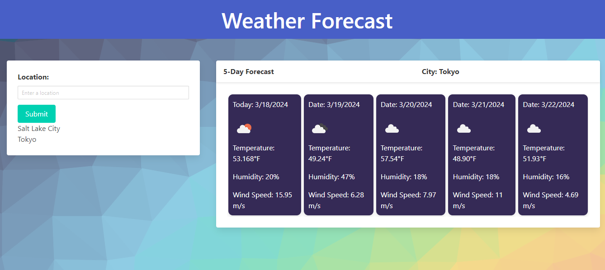

# Weather Forecast 
  
## Description
A simple weather forecast built with JavaScript and OpenWeatherMap API's. It allows the user to enter any city to get a 5 day weather forecast.
  
## Table of Contents
- [Installation](#installation)
- [Usage](#usage)
- [License](#license)
- [Authors](#authors)
- [Screenshots](#screenshots)
- [Links](#links)
  
## Screenshots

## Links
[Weekly Forecast](https://connorspendlove.github.io/Weekly-Forecast/)

## Installation
N/A
  
## Usage
Enter a city into the search bar, and hit submit. To view previouslly entered cities, click on them below the search bar.
  
## License
This project is licensed under the MIT license.
  
## Authors
View my GitHub account [Here](https://www.github.com/ConnorSpendlove)
